# Ngrembaka Aksara (FastAPI)

Website literasi berbasis FastAPI + Jinja2 + SQLite dengan admin CMS untuk mengelola konten E-Library, Dokumentasi, dan Artikel.

## Stack

- FastAPI
- Jinja2 Templates
- SQLAlchemy + SQLite
- Uvicorn
- JWT (cookie auth untuk admin)
- Upload file lokal (gambar + PDF)

## Fitur Utama

- Halaman publik:
	- Landing (`/`)
	- Beranda (`/beranda`)
	- Profil Aksara (`/profil/ngrembaka-aksara`)
	- Profil Kelurahan (`/profil/kelurahan-podorejo`)
	- E-Library (`/elibrary` dan `/elibrary/{kategori}`)
	- Pojok Literasi: Tunas, Karya, Cakra, Kersa
- Admin CMS:
	- Login admin (`/admin/login`)
	- Dashboard ringkasan data (`/admin`)
	- CRUD E-Library (`/admin/elibrary`)
	- CRUD Dokumentasi (`/admin/dokumentasi`)
	- CRUD Artikel (`/admin/artikel`)
	- Pengaturan website (`/admin/settings`)

## Preview Tampilan

Berikut capture tampilan aplikasi yang sudah terbentuk agar dokumentasi lebih informatif.

### Halaman Publik

<p><strong>Landing Page</strong></p>
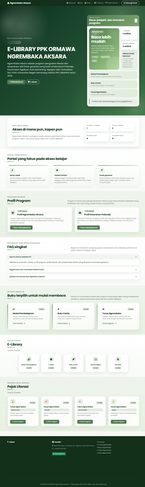

<p><strong>Pojok Literasi Tunas</strong></p>
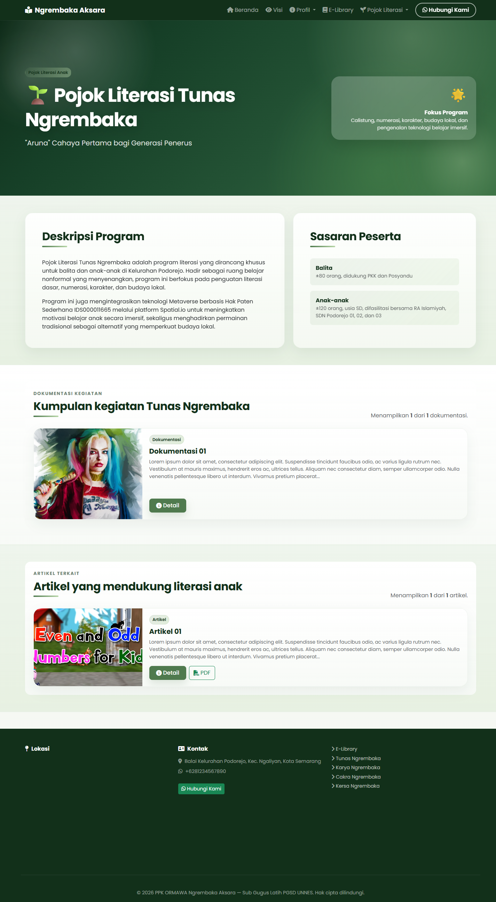

<p><strong>E-Library</strong></p>
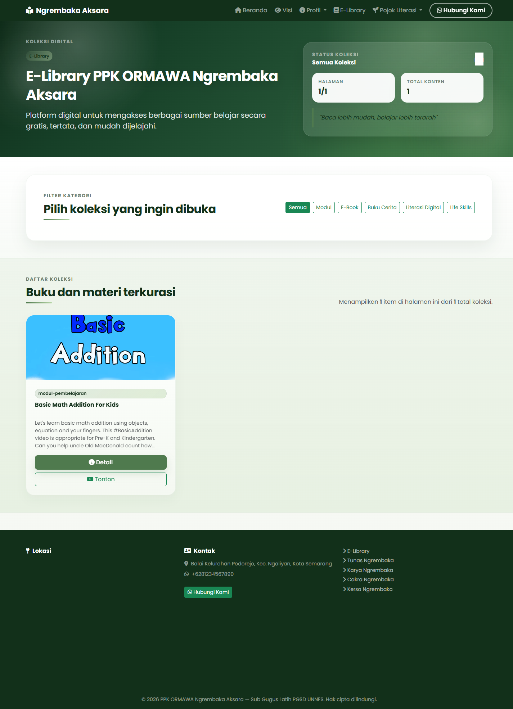

### Admin CMS

<p><strong>Login Admin</strong></p>
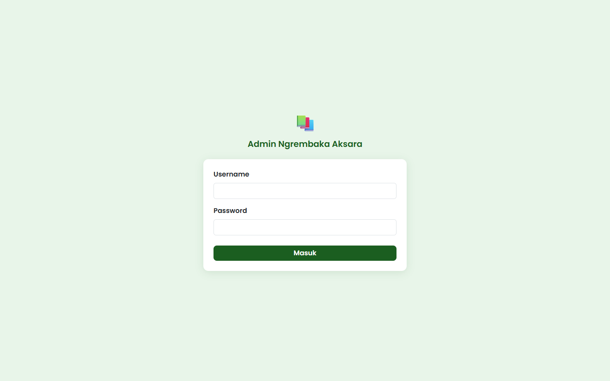

<p><strong>Dashboard Admin</strong></p>
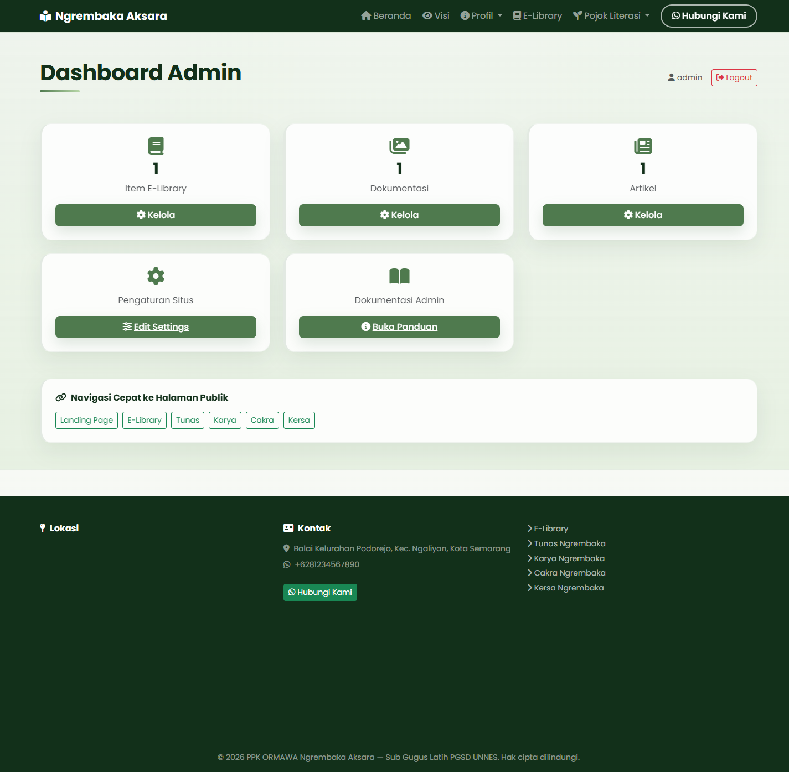

<p><strong>Kelola Dokumentasi</strong></p>
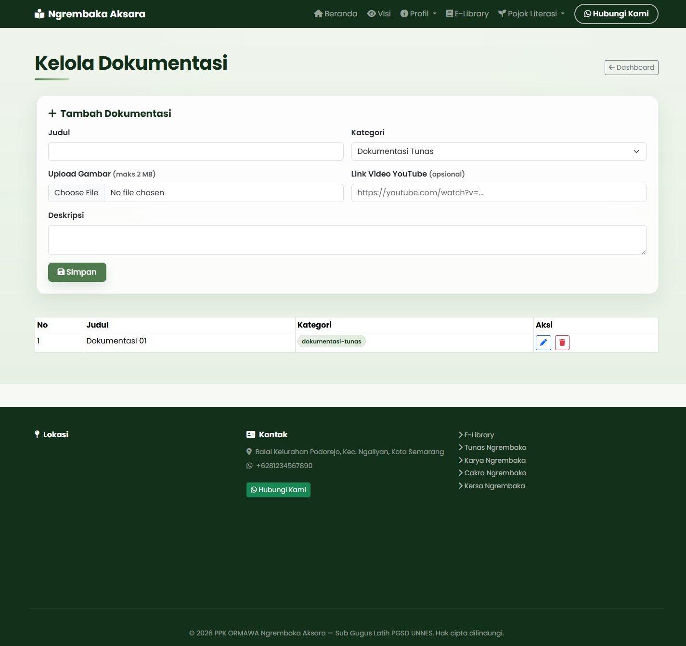

<p><strong>Kelola E-Library</strong></p>
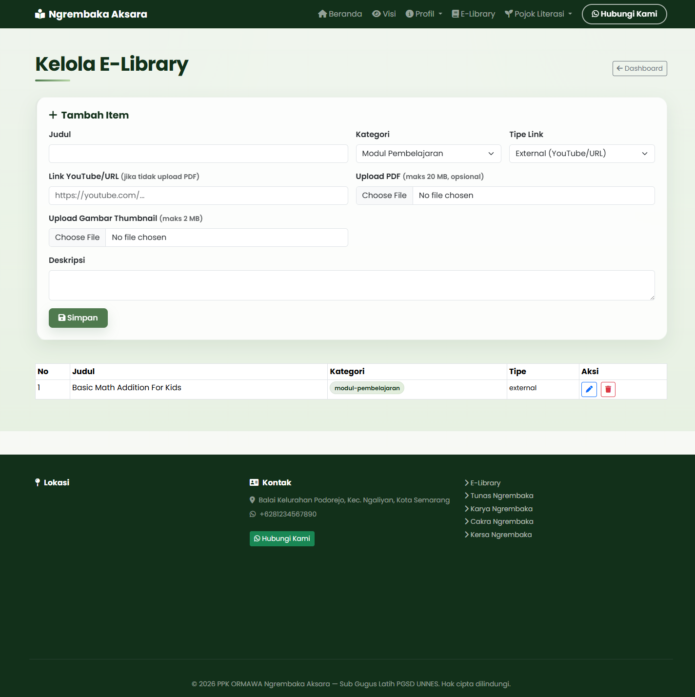

<p><strong>Kelola Artikel</strong></p>
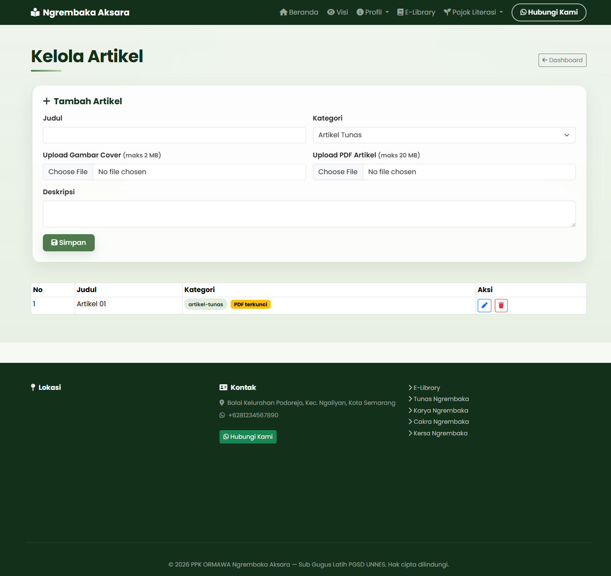

<p><strong>Pengaturan Situs</strong></p>
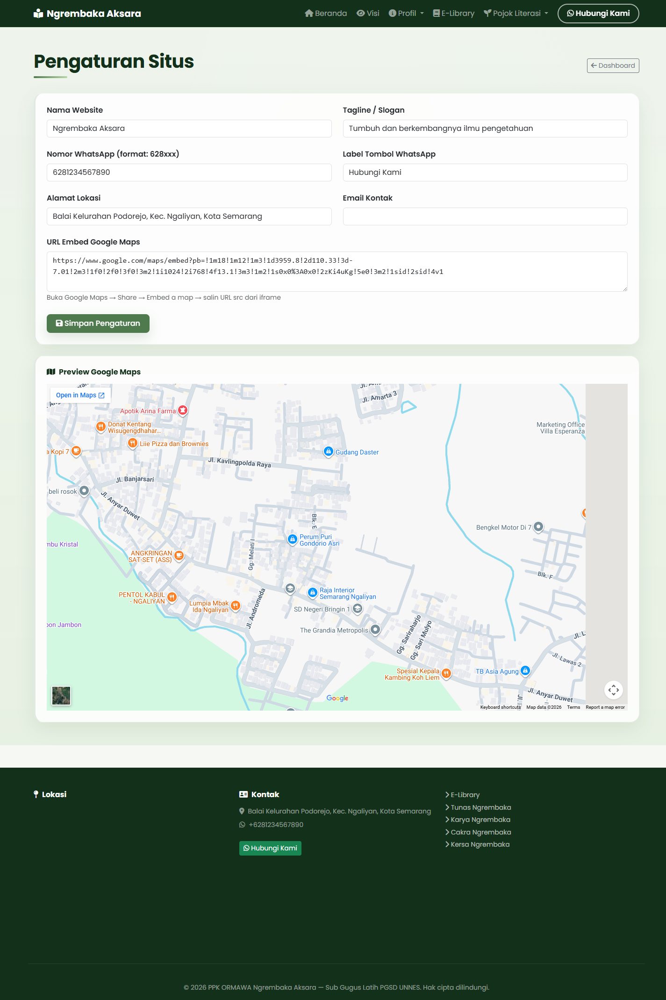

### Preview Mobile (Contoh)

<p><strong>Landing Page (Mobile)</strong></p>
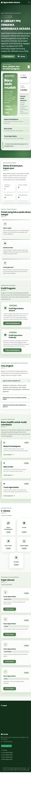

<p><strong>Pojok Literasi Tunas (Mobile)</strong></p>
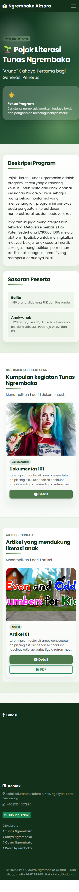

<p><strong>Dashboard Admin (Mobile)</strong></p>
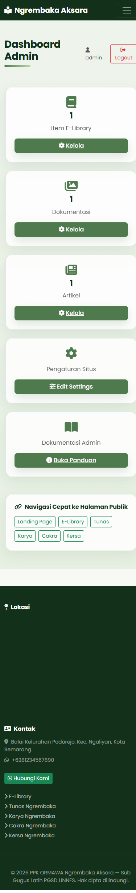

## Dokumentasi

Panduan berikut disediakan agar pengguna dan admin bisa langsung membuka alur yang dibutuhkan:

- [Panduan Pengguna](docs/user.md)
- [Panduan Admin](docs/admin.md)
- [Panduan Tunneling](docs/tunneling.md)
- [Panduan Domain / Reverse Proxy](docs/domain.md)
- [Referensi Teknis Aplikasi](docs/fast-aksara.md)

### Untuk pengguna umum

- Baca [Panduan Pengguna](docs/user.md) untuk memahami cara memakai halaman publik.

### Untuk admin pengelola

- Baca [Panduan Admin](docs/admin.md) untuk login, kelola konten, dan mengubah settings.

### Untuk deployment

- Baca [Panduan Tunneling](docs/tunneling.md) jika ingin menghubungkan domain ke server.
- Baca [Panduan Domain / Reverse Proxy](docs/domain.md) jika memakai Nginx atau proxy domain.

## Struktur Folder

```text
fast-aksara/
├── backend/
│   ├── app/
│   │   ├── main.py
│   │   ├── database.py
│   │   ├── models.py
│   │   ├── routers/
│   │   ├── static/
│   │   └── templates/
│   ├── requirements.txt
│   ├── seed.py
│   └── .env
├── docker/
│   ├── Dockerfile
│   └── docker-compose.yml
└── docs/
```

## Menjalankan Secara Lokal

1. Masuk ke folder backend:

```bash
cd backend
```

2. Buat virtual environment dan aktifkan:

```bash
# Linux / MacOS
python3 -m venv .venv
source .venv/bin/activate

# Windows
python -m venv .venv
.venv\Scripts\activate
```

3. Install dependensi:

```bash
pip install -r requirements.txt
```

4. Isi file `.env` (contoh minimum):

```env
SECRET_KEY=ganti-dengan-random-string-panjang-minimal-32-karakter
ALGORITHM=HS256
ACCESS_TOKEN_EXPIRE_MINUTES=480
ADMIN_USERNAME=admin
ADMIN_PASSWORD=Admin
MAX_UPLOAD_IMAGE_MB=2
MAX_UPLOAD_PDF_MB=20
APP_ENV=development
```

5. Jalankan aplikasi:

```bash
uvicorn app.main:app --reload --host 0.0.0.0 --port 8000
```

6. Buka browser:

- `http://localhost:8000`
- `http://localhost:8000/admin/login`

## Deployment Docker (Port 3004)

Konfigurasi Docker sudah disiapkan di folder `docker` untuk menjalankan aplikasi di port `3004`.

1. Masuk ke folder docker:

```bash
cd docker
```

2. Build dan jalankan container:

```bash
docker compose up -d --build
```

3. Cek status:

```bash
docker compose ps
```

4. Lihat log:

```bash
docker compose logs -f
```

App akan tersedia di:

- `http://192.10.10.152:3004`

## Persistensi Data

`docker-compose.yml` menggunakan volume agar data tidak hilang saat restart:

- `aksara_db` -> menyimpan file SQLite (`/app/aksara.db`)
- `aksara_uploads` -> menyimpan upload gambar/PDF (`/app/app/static/uploads`)

## Catatan Produksi

- Ganti `SECRET_KEY` dengan nilai acak yang kuat.
- Ganti `ADMIN_PASSWORD` default sebelum go-live.
- SQLite cocok untuk satu server kecil; untuk production publik atau multi-instance, pindah ke database yang lebih sesuai lewat `DATABASE_URL`.
- Pastikan DNS/reverse proxy domain sudah mengarah ke server dan port aplikasi.

## QNA

### Halaman kosong saat dibuka di browser

Kalau aplikasi sudah di-start tapi browser menampilkan halaman kosong atau error, cek tiga hal ini dulu:

1. Buka aplikasi lewat `http://localhost:8000` atau `http://127.0.0.1:8000`, jangan lewat `http://0.0.0.0:8000` karena itu bukan alamat yang dibuka dari browser.
2. Pastikan server benar-benar berjalan dari folder `backend/` dan memakai virtual environment proyek.
3. Jika port `8000` sudah dipakai proses lain, jalankan di port lain, misalnya `8001`.

Contoh perintah yang aman di Windows:

```bash
cd backend
.venv\Scripts\activate
python -m uvicorn app.main:app --reload --host 127.0.0.1 --port 8001
```

Kalau masih gagal start, biasanya penyebabnya dependensi belum terpasang di venv. Jalankan:

```bash
pip install -r requirements.txt
```

4. Kill port 
```bash
sudo lsof -t -i:8000 | xargs sudo kill -9

# Windows
netstat -ano | findstr :8000
# Kill proses berdasarkan PID
taskkill /PID 1234 /F
```

## Pembelajaran Pembuatan Website Aksara

Dokumen pembelajaran proyek ini sudah tersedia di folder [docs/](docs/). Silakan pilih materi sesuai tahap belajar:

- [Pembelajaran 1](docs/pembelajaran-1.md) — pengenalan proyek, tujuan, dan ruang lingkup website Aksara.
- [Pembelajaran 2](docs/pembelajaran-2.md) — perancangan mockup dan struktur halaman utama yang akan dibuat.
- [Pembelajaran 3](docs/pembelajaran-3.md) — implementasi HTML halaman utama dan halaman pendukung sesuai mockup.
- [Pembelajaran 4](docs/pembelajaran-4.md) — styling dasar CSS dan tata letak responsif.
- [Pembelajaran 5](docs/pembelajaran-5.md) — mapping objek data ke halaman dan solusi detail per file.
- [Pembelajaran 5A](docs/pembelajaran-5a.md) — Jinja dasar dan interaksi CRUD sederhana dengan data in-memory.
- [Pembelajaran 5B](docs/pembelajaran-5b.md) — CRUD dengan SQLite dan model data yang lebih nyata.
- [Pembelajaran 6](docs/pembelajaran-6.md) — render data dinamis dari backend ke template Jinja2.
- [Pembelajaran 7](docs/pembelajaran-7.md) — CRUD admin dan form untuk manajemen konten.
- [Pembelajaran 8](docs/pembelajaran-8.md) — skema database lanjutan, model, seed, dan pengelolaan data.
- [Pembelajaran 9](docs/pembelajaran-9.md) — autentikasi admin, role, dan keamanan upload file.
- [Pembelajaran 10](docs/pembelajaran-10.md) — unit test API dengan Pytest untuk validasi endpoint.
- [Pembelajaran 11](docs/pembelajaran-11.md) — penghubungan full flow dari form admin ke database sampai halaman publik.
- [Pembelajaran 12](docs/pembelajaran-12.md) — deployment aplikasi dengan Docker Compose.
- [Pembelajaran 13](docs/pembelajaran-13.md) — hosting, domain, dan Cloudflare Tunnel untuk akses publik.

Materi tambahan yang relevan:

- [Panduan Pengguna](docs/user.md) — panduan penggunaan halaman publik untuk pengguna umum.
- [Panduan Admin](docs/admin.md) — panduan login, CRUD, dan pengelolaan konten admin.
- [Panduan Tunneling](docs/tunneling.md) — langkah menghubungkan server lokal ke domain publik lewat Cloudflare Tunnel.
- [Panduan Domain / Reverse Proxy](docs/domain.md) — panduan konfigurasi domain dan proxy jika digunakan di server nyata.
- [Referensi Teknis Aplikasi](docs/fast-aksara.md) — dokumentasi teknis aplikasi dan struktur implementasi.

Catatan: urutan pembelajaran bisa disesuaikan dengan kebutuhan kelas, namun dokumen ini berfungsi sebagai indeks utama untuk belajar dari awal sampai deployment.


